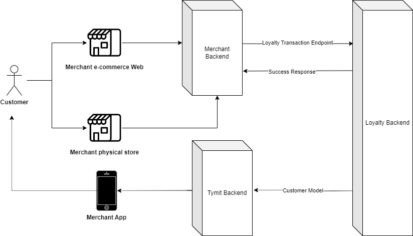

<div style="display:none;">
  Frasers plus developer documentation
</div>

# Frasers Plus - Partnerships Integration Handbook

| Contents                                                              |
| --------------------------------------------------------------------- |
| [Document Version Control](#document-version-control)                 |
| [Introduction](#introduction)                                         |
| [Stakeholders Clients and Systems](#stakeholders-clients-and-systems) |
| [Payment Integration](#payment-integration)                           |
| [Business Flows](#business-flows)                                     |
| [E-commerce Payment](#e-commerce-payment)                             |
| [In-store Payment (POS)](#in-store-payment-pos)                       |
| [API Integrations](#api-integrations)                                 |
| [E-commerce Payment API](#e-commerce-payment-api)                     |
| [POS Payment API](#pos-payment-api)                                   |
| [Mock API & “Magic Values”](#mock-api--magic-values)                  |
| [Full Sequence diagrams](#full-sequence-diagrams)                     |
| [E-comm flows](#e-comm-flows)                                         |
| [POS Flow](#pos-flow)                                                 |
| [Merchant Registration/Onboarding](#merchant-registrationonboarding)  |
| [Onboard Merchant Fascia](#onboard-merchant-fascia)                   |
| [Security summary](#security-summary)                                 |
| [Webhook security](#webhook-security)                                 |
| [Authentication Type](#authentication-type)                           |
| [How to Test an Integration](#how-to-test-an-integration)             |
| [Development/Unit Testing](#developmentunit-testing)                  |
| [Staging](#staging)                                                   |
| [How to Promote to Production](#how-to-promote-to-production)         |
| [Loyalty Integration](#loyalty-integration)                           |
| [Business Flows](#business-flows-1)                                   |
| [Tracking Purchases](#tracking-purchases)                             |
| [Reward Redemption](#reward-redemption)                               |
| [API Integration](#api-integration)                                   |
| [Reward Redemption API](#reward-redemption-api)                       |
| [Appendices](#appendices)                                             |
| [Glossary of Terms](#glossary-of-terms)                               |

# Document Version Control

| Version Number | Description                                                      | Issued by                  | Date Issued |
| -------------- | ---------------------------------------------------------------- | -------------------------- | ----------- |
| V0.9           | Document includes required detail for Payment Integration.       | Lisa Hay                   | 04/03/2024  |
| V1.0           | Document reviewed for 1st release                                | Ian Stacey & Chris Balchin | 08/03/2024  |
| V1.1           | Document reviewed and updated, “magic values” in Mock API added. | Ian Stacey                 | 26/04/2024  |
| V1.2           | Loyalty Transaction payload updated including descriptions       | Lisa Hay                   | 04/06/2024  |
| V1.3           | Updated to include references to webhooks for Pay.               | Ian Stacey                 | 05/11/2024  |
| V1.3.1         | Update links to reference DI                                     | Khole Jones                | 18/12/2024  |

# Introduction

In this document you will find guides and API reference documentation to integrate your business with _Frasers Plus_ product.

## Stakeholders Clients and Systems

- **Customer**: end customers who buy products from the merchant e-commerce or stores.

- **Merchant e-commerce Web**: merchant website (e-commerce) where customers are adding products to the basket to later pay with Frasers Plus system. Technically this is the front end of the merchant e-commerce.

- **Merchant Backend**: this is the backend of the merchant. It interacts with the Merchant e-commerce and Tymit Backend in order to process the different requests, i.e. payments.

- **Frasers Plus App (built by Tymit)**: this is the app built by Tymit and customised for Frasers. Customers interact with this app in order to manage purchases, instalments, loyalty points, pay with QR code in stores, approve purchases, etc.

- **Frasers Plus HPP** **(built by Tymit)**: this is the _Hosted Payment Page_ built by Tymit and customised for Frasers. It is a web site that manages all customer interactions to verify identity, onBoard new customers and wating for the customer to approve the purchase order.

- **Tymit Backend**: this is the Tymit system which manages all the on-boardings, payment methods (like QR), purchases, loyalty, etc. It interacts with Merchant Backend, **Frasers Plus App** and **Frasers Plus HPP**.


_A_ [_Glossary of Terms_](#glossary-of-terms) _is available at the end of this document._

# Payment Integration

The following sections describe and demonstrate the user flows and integration mechanisms with the **Frasers Plus** payment system.

## Business Flows

In order to integrate your merchant with **Frasers Plus** payment system, the following section will provide an understanding of how _Merchants_ interact.

There are two main flows: purchase from e-commerce and purchase from In-store (POS).

### E-commerce Payment


The customer is purchasing from the Merchant e-commerce. At some point they want to pay the basket. They select the option to pay with the **Frasers Plus** option. There are 3 main scenarios:

1.  The customer already has an account in **Frasers Plus**. In this case the customer will receive a push notification in the app to approve the payment (this flow in e-commerce is known as **Fast Track**).  
    In the meantime customer browser will be redirected to the **Frasers Plus HPP** until process is finished.

2.  The customer may have an account in **Frasers Plus,** but customer data provided (e.g. name, surname) differs from **Frasers Plus** payment system info, this is called **Partial Match**. Customer browser will be redirected to the **Frasers Plus HPP.** It will trigger customer verification process through SMS OTP, once challenge is passed, the customer will receive a push notification in the app to approve the payment.

3.  The customer does not have an account in **Frasers Plus**, this is called **New Customer**. Customer browser will be redirected to the **Frasers Plus HPP.** It will trigger onBoarding process into **Frasers Plus**. When finished the customer will receive a push notification in the app to approve the payment.

### In-store Payment (POS)


The customer is purchasing In-Store. At some point they want to pay at the counter. Then there are 2 scenarios:

1.  The customer already has an account in **Frasers Plus**. In this case the customer will login to the app and will show the payment QR code to pay in the POS.

2.  The customer does not have an account in **Frasers Plus**. In this case the store will probably have a QR code to scan, which contain a link with the landing page in the **Frasers Plus Landing Page** to start the on-boarding process. Customer will be prompted to download the **Frasers Plus** App at some point to finish the onboarding. After that, the customer will be able to use the payment QR code.

## API Integrations

Once we understand the above section on how Merchants interact with **Frasers Plus** through the main flows, let’s explain the API integration.

Merchants will have the next APIs to integrate with **Frasers Plus** to make payments:

- **E-comm Payment API** → there is just 1 endpoint, to start the process POSTing a Payment AUTHORIZATION and finishing it with the following options: CATURE, REVERSAL and CREDIT

- **POS Payment API** → there is just 1 endpoint, to execute the process POSTing a Payment AUTHORIZATION_CATURE action. In this flow there is no further actions.

Next we will explain all the details of the above integrations.

### E-commerce Payment API

Full, detailed technical documentation is available in Swagger at the following location. However a summary of the endpoint is included in this section.

[Swagger API documentation](https://app.swaggerhub.com/apis/tymit/tymit-merchants-ecommerce-api/1.0.0)

#### POST /payment (AUTHORIZATION)

POST Payment is the first endpoint that the merchant (only e-commerce) request to pay the purchase. The aim is to obtain the **Unique Payment Token (UPT)** to later GET Payment details, and the _url_ to redirect the browser to the **Frasers Plus HPP.**

From user experience, this happens when the customer clicks on pay the basket with **Frasers Plus** option.

**Endpoint:** POST to https://{environment-url}/v1/payment (more details in the API documentation).

```json
{
  "paymentId": "09900022030372702871537096",
  "type": "AUTHORIZATION",
  "method": "ONLINE",
  "mcc": "2017",
  "customer": {
    "id": "eff1ee72-88e6-11ec-a8a3-0242ac120002",
    "firstName": "Joe",
    "lastName": "Doe",
    "phone": "+441234567890",
    "email": "joe.doe@email.com",
    "billingAddress": {
      "city": "San Francisco",
      "country": "US",
      "line1": "123 Main Street",
      "line2": "",
      "postalCode": "94111",
      "state": "CA",
      "region": ""
    },
    "deliveryAddress": {
      "city": "San Francisco",
      "country": "US",
      "line1": "123 Main Street",
      "line2": "",
      "postalCode": "94111",
      "state": "CA",
      "region": ""
    }
  },
  "merchant": {
    "id": "f41201ea-88e6-11ec-a8a3-0242ac120002",
    "name": "Merchant Name",
    "redirectUrl": "https://example.com",
    "metadata": {
      "optionalField1": "optionalValue1"
    }
  },
  "avs": false,
  "description": "Cycle Mitts, Tyre Repair Kit, Bike",
  "paymentAmount": {
    "amount": 500.89,
    "currency": "GBP"
  },
  "expiresAt": "2022-02-22T22:10:47.720Z",
  "basketTimestamp": "2022-02-22T22:00:47.720Z",
  "metadata": {
    "optionalField1": "optionalValue1"
  }
}
```

- merchant.id will be provided by Tymit as part of the merchant registration process (see Merchant Registration section below)

- paymentId, customer.id, merchant.redirectUrl will be provided by the merchant with merchant internal values/identifiers.

  - redirectUrl will be the url where will be redirected the customer once the payment is completed/declined/failed from the Hosted Payment Page. Every merchant can include any identifier parameters (path and query). We will amend a query param paymentResult with the outcome of the operation. Nonetheless, we strongly recommend to perform a GET to our API in order to get the result after the redirection.

- metadata, merchant.metadata will be optionally provided by the merchant with any value(s)

Regarding the response, it will contain _UPT_ and a _URL_:

```json
{
  "uniquePaymentReference": "f41201ea-00e6-11ec-a8a3-987654321098",
  "redirectUrl": "https://application.pay.frasers.plus/checkout/redirect?sessionId=f41201ea-00e6-11ec-a8a3-987654321098"
}
```

Merchants backend system should do the following:

- Store UPT linked to the paymentId for further Payment details verification process.

- Send the URL to the _Merchant e-commerce Web_ so customer browser can be redirected to that URL. That is in fact the **Frasers Plus HPP.**

#### **Authorization** **webhook**

If configured (\*), Frasers Plus backend system will call a webhook API endpoint exposed by the Merchant Backend, with the result of the Payment Authorization.

Endpoint: POST to https://{merchant-domain}/{merchant_authorization_endpoint}

```json
{
  "uniquePaymentReference": "f41201ea-00e6-11ec-a8a3-987654321098",
  "type": "AUTHORIZATION",
  "status": "APPROVED",
  "paymentAmount": {
    "amount": 100.0,
    "currency": "GBP"
  },
  "actionDate": "2022-02-22T22:10:47.720Z",
  "metadata": {
    "merchantReference": "12344-45566"
  }
}
```

status field value will be: “APPROVED” or “DECLINED”.

**Managing responses:**

- 2XX. Webhook call will be considered successful. No retry.

- 4XX. Webhook call will be discarded. No retry.

- 429, 5XX and other. Webhook call will be retried 3 times with an exponential backoff mechanism. Once exhausted, it will go to DLQ for future re-process if required.

**Webhook considerations**

This notification process is design with “At least once” approach, meaning the Merchant Backend may receive more than once the same request with the same uniquePaymentReference. Merchant Backend must be ready to handle that scenario responding with a 2XX eventually.

Given the asynchronous nature of this communication, Merchants must not expect webhook and web page redirection happening in any specific order.

_\* If webhooks are not enabled, it is strongly advised to “poll” the GET endpoint during the authorisation process to identify when a customer has responded to the authorisation approval request in the Frasers Plus app. This mitigates the risk that the customer chooses not to return to the hosted payment page (and subsequently the merchant site) following the in app approval resulting in the funds being authorised, but no order being placed._


#### **PUT /payment (CAPTURE)**

REVERSAL and CAPTURE are exclusive, only one can happen after AUTHORIZATION.

It is the second step in e-commerce payment after the payment is APPROVED. Once the Merchant warehouse can confirm that the goods can be sent to the customer, it requests to Payment e-commerce endpoint again, but this time with type _CAPTURE_ in the payload. The response will contain the status of the CAPTURE process. As a result of this, the payment will be shown as _COMPLETED._

**Endpoint:** PUT to https://{environment-url}/v1/payment/{uniquePaymentReference} (more details in the API documentation).

```json
{
  "type": "CAPTURE",
  "paymentAmount": {
    "amount": 500.89,
    "currency": "GBP"
  }
}
```


The following flows allows to return the credit to the customer if the initial purchase is somehow cancelled.

#### **PUT /payment (REVERSAL)**

_Reversal_ flow will be used when e-commerce cancels a customer authorization before Capture.

REVERSAL and CAPTURE are exclusive, only one can happen after AUTHORIZATION.

It is the next step after an _APPROVED_ authorization when the e-commerce needs to cancel the purchase, for instance if the product is no longer available in the warehouse. Once the Merchant Backend confirms that the goods can NOT be sent to the customer, it requests to Payment e-commerce endpoint again, but this time with type _REVERSAL_ in the payload. As a result of this, the purchase will be shown as _CANCELLED_ in customer bill, and the available credit will be increased accordingly.

**Endpoint:** PUT to https://{environment-url}/v1/payment/{uniquePaymentReference} (more details in the API documentation).

```json
{
  "type": "REVERSAL",
  "paymentAmount": {
    "amount": 500.89,
    "currency": "GBP"
  }
}
```

#### **PUT /payment (CREDIT)**

_Credit_ flow will be used when customer returns partially or totally the goods acquired.

CREDIT could happen only after transaction CAPTURE is properly processed.

It is the next step after _CAPTURE_ when the customer returns some goods therefore customer credit needs to be amended . Once the Merchant Backend confirms that the goods has been returned, it requests to Payment e-commerce endpoint again, but this time with type _CREDIT_ in the payload. As a result of this, the purchase will be shown as _returned_ in customer bill, and the available credit will be increased accordingly. CREDIT may happen several times for the same transaction, but total amount of credits should not be higher than original transaction amount.

**Endpoint:** PUT to https://{environment-url}/v1/payment/{uniquePaymentReference} (more details in the API documentation).

```json
{
  "type": "CREDIT",
  "paymentAmount": {
    "amount": 500.89,
    "currency": "GBP"
  }
}
```

#### GET /payment/

_Get_ **flow could be used to get full details of a payment at any point. Main use cases:**

- **Right after getting authorization webhook requests, to get full details before you trigger your PUT /payment (CAPTURE) process**

- **During polling process after POST /payment, if webhooks are not configured. To know when payment Authorization has been completed or declined, before you trigger your PUT /payment (CAPTURE) process**

- **To reconcile payment states on timeouts or 5xx scenarios during CAPTURE process, before you trigger your order fulfillment process.**

**Endpoint: GET to** https://{environment-url}/v1/payment/{uniquePaymentReference} **(more details in the API documentation). No request payload expected.**

**Example of response payload for a Payment with Authorization approved, not yet captured or reversed:**

```json
{
  "type": "AUTHORIZATION",
  "status": "APPROVED",
  "history": [
    {
      "type": "AUTHORIZATION",
      "paymentAmount": {
        "amount": 500.89,
        "currency": "GBP"
      },
      "actionDate": "2022-02-22T22:10:47.720Z",
      "metadata": {
        "paymentId": "09900022030372702871537096"
      }
    }
  ]
}
```

See section Mock API & “Magic Values” for more details.

### **POS Payment API**

API documentation → TBD

#### POST /payment (AUTHORIZATION_CAPTURE)

In POS flow the Payment process is done by a single request containing both transaction steps executed simultaneously to process the payment, _authorization_ and _capture._

**Endpoint:** POST to https://{environment-url}/v1/payment (more details in the API documentation).

(TBD) Example of payload:

TBD

In POS, both authorization and capture are sent at the same time, since the customer purchases in the physical store and once they pay, they take the products with them. The customer logs into the app, scan the payment QR code in the store to pay, at this moment the Merchant Backend requests to Payment POS endpoint with type _AUTHORIZATION_CAPTURE_ in the payload. Tymit response synchronously with an Accepted to the Merchant Backend and hence to the store in real time.


#### **PUT /payment (CREDIT)**

_Credit_ flow will be used when customer returns partially or totally the goods acquired.

CREDIT could happen only after transaction CAPTURE is properly processed.

It is the next step after CAPTURE when the customer returns some goods therefore customer credit needs to be amended . Once the Merchant Backend confirms that the goods has been returned, it requests to Payment e-commerce endpoint again, but this time with type _CREDIT_ in the payload. As a result of this, the purchase will be shown as _returned_ in customer bill, and the available credit will be increased accordingly. CREDIT may happen several times for the same transaction, but total amount of credits should not be higher than original transaction amount.

REVERSAL should not happen in POS API, because authorisation and capture happens simultaneously.

## Full Sequence diagrams

In this section we summarize the above API integration section in sequence diagrams.

### E-comm flows

#### Payment Auth: Fast track


#### Payment Auth: Partial match


#### Payment Auth: New customer


#### Payment Capture


#### Payment Reversal


#### Payment Credit


### POS Flow

#### QR Payment in Store


## Merchant Registration/Onboarding

In this handbook, we will explain from Business and technical perspective the process, the steps, and evaluations that are being done to wire up a new Merchant Fascia into the F+ Tymit ecosystem, this approach is being followed for ECommerce and POS; all being supervised by the relevant teams involved, and applying the already signed security, and architectural specs

The current Merchant Fascia onboarding is based on **2** main **pillars**:

1.  **Staging** **Integration** **verification**

    1.  Onboard Fascia in our **Staging** environment

    2.  Verify API Integration on: <https://app.swaggerhub.com/apis/tymit/tymit-merchants-ecommerce-api>

    3.  Develop, and test integration on with Merchant API (<https://merchant-api.staging.tymit.com>)

2.  **Production** **Integration**

    1.  Onboard Fascia in our **Production** environment

    2.  Develop, and test integration on with Merchant API ([https://merchant-api.frasersplus.fgfs.service](https://merchant-api.frasersplus.fgfs.service/))

### Onboard Merchant Fascia

#### Ecommerce

#### **To be provided by the Merchant to Tymit**

| **Requirement**                              | **Description**                                                                                                                                                                                                                                                                                     | **Examples**                                     |
| -------------------------------------------- | --------------------------------------------------------------------------------------------------------------------------------------------------------------------------------------------------------------------------------------------------------------------------------------------------- | ------------------------------------------------ |
| Merchant Sensitive Information contact email | The merchant will require to share an admin email of the group to which the relevant sensitive information will be shared back. The information needs to be provided in an email format to: [**platform@tymit.com**](mailto:platform@tymit.com) |                                                  |
| Merchant Platform Outgoing IPs               | Merchant IP in order to whitelist on Frasers Plus platform firewalls.                                                                                                                                                                                                                               | _35.178.42.70_, _3.121.132.125_, _3.121.132.126_ |
| Group Name                                   | The Merchant Group name that holds the onboarding of the new fascia. Usually a Merchant group can hold up the N fascias or on the other hand the Group Name can be the fascia it self.                                                                                                              | _Frasers Group_                                  |
| Fascia Name                                  | The Fascia name of the company to be onboarded; this is mainly the brand that will sell the products, usually a fascia belongs to a bigger group.                                                                                                                                                   | _Sports Direct_, _House of Fraser_, _Studio_     |

#### **To be returned to the Merchant by Tymit**

| **Requirement** | **Description**                                                                                                                                                             | **Examples**                                                       |
| --------------- | --------------------------------------------------------------------------------------------------------------------------------------------------------------------------- | ------------------------------------------------------------------ |
| API Key         | API key that will be used by the fascia of the merchant to communicate with Tymit v2 Payment platform                                                                       | q95WmxWu90Kelx3fNsLk1N4L, 0m93ue5pe9mp30u5rjv, k8gpoj7xrxn9q9hfpl4 |
| Store ID        | Identifier which will be needed to be used by the fascia of the merchant to communicate with Tymit v2 Payment Platform, and identify the identity with the provided API Key | MerchantstoreWz39t, MerchantdirectT2p9l, Merchandland93cv          |

#### Exchange of sensitive information

The sensitive information returned by Tymit will be done via [**Bitwarden Send**](https://bitwarden.com/products/send/) and the links will be exchanged to the outside world by via [**Microsoft Encrypted Emails**](https://support.microsoft.com/en-us/office/encrypt-email-messages-373339cb-bf1a-4509-b296-802a39d801dc) to the **email** **specified** by the information provided by the merchant.

#### Summary


## Security summary

| **API**   | **WAF Perimeter Security** | **API Inner security**   |
| --------- | -------------------------- | ------------------------ |
| ECommerce | IP Whitelisting            | **API** **Key** / Fascia |

### Webhook security

WAF Perimeter Security (on Merchants side)

IP addresses that webhooks will originate are as follow (as at 02/10/2024)…

- staging: 3.121.132.125 & 52.215.99.246

- production: 3.8.74.182 & 3.11.167.29

### Authentication Type

The merchant is required to provide a shared key to be included in the header of the webhook request. Value provided will be sent in the Authorization HTTP Header.

curl \<https://merchantdomain.com/webhook_uri_provided\> \\\\

\-H "Authorization:\$(auth_value_provided)"

## How to Test an Integration

### Development/Unit Testing

Development activity should be undertaken against the Mock (sandbox) APIs as shared in Swagger.

### Staging

To allow Merchants to test an integration with Frasers Plus, the following is required:

1.  The Staging host name will be issued to the Merchant to use in the Merchant's staging environment.

2.  Access to the Frasers Plus App in Test Flight that allows test Frasers Plus Pay accounts to be tested against.

3.  A Merchant ID to be issued for the merchant site to be tested.

4.  Private API Keys to be issued to the merchant for staging use.

5.  Exchange of IP addresses/ranges that need to be allowed on firewalls for staging.

6.  Agreement of the Merchant Name that the merchant is using in Staging to aid debug during testing.

## How to Promote to Production

To promote an integration to production, the following is required:

1.  The Production host name will be issued to the Merchant to use in the Merchant's production environment.

2.  A Merchant ID to be issued for the merchant site to be promoted to production.

3.  Private API Keys to be issued to the merchant for production use.

4.  Exchange of IP addresses/ranges that need to be allowed on firewalls for production.

5.  Confirmation of the Merchant Name that the merchant is using in production.

# Loyalty Integration

## Business Flows

To integrate your merchant operations with Frasers Plus Loyalty, it's important to understand how Merchants interact with Frasers Plus Loyalty and the overall high-level flow. We will explain two main business flows: tracking purchases from e-commerce and from physical stores (POS) and redemption of rewards from e-commerce and from physical stores.

### Tracking Purchases

To calculate Frasers Plus Loyalty points the merchant must provide Frasers Plus transaction data from the Ecommerce and Retail environments to the Loyalty backend. Loyalty backend will associate the transaction to the customer and calculate points which will be passed back to the Frasers Plus backend to update the Frasers Plus app with the current pending points balance.



### Reward Redemption

#### E-commerce Reward Redemption

Where the customer chooses to pay with a Frasers Plus Reward the customer enters their Reward identifier and PIN code, the Merchant Backend requests to Loyalty Reward redemption authorisation endpoint. The merchant backend will receive a http response code and payload including relevant information. At this stage the payment has been authorised and the funds ringfenced. Subsequent endpoints would be called from the merchant backend for capture, void or refund flows, further detail in the [API Integration section](#_API_Integration).

GET

#### Physical Stores (POS) Redemption

Where the customer chooses to pay with a Frasers Plus Reward the customer scans their Reward identifier, the Merchant Backend or direct from POS (alternate flow) requests to Loyalty Reward redemption authorisation/capture endpoint. The merchant backend/POS will receive a http response code and payload including relevant information. At this stage the payment has been authorised and captured. Subsequent endpoints would be called from the merchant backend/POS for refund flow, further detail in the [API Integration section](#_API_Integration).


### API Integration

Merchants will have access to the following API’s to integrate with Frasers Plus loyalty for sending transaction data and making a payment using Frasers Plus Rewards

#### Transaction API

This endpoint serves as the entry point to Frasers Plus Loyalty for e-commerce and physical stores transactions. All transactions made using Frasers Plus as a tender type will need to be sent to the Loyalty backend to process points calculation. This includes all transaction events:

\* Order Complete

\* Order Refund

\* Cancellation/void

\* Exchange

\* Shipped (TBC)

Frasers Group Financial Services will work with you to map the relevant fields and confirm mandatory values and determine the best library and method to send transaction data to the endpoint, batch being the preferred.

Example of an order complete tracking plan:

| **Property Name**                   | **Description**                                                                                                           | **Property Status** | **Property Data Type** |
| ----------------------------------- | ------------------------------------------------------------------------------------------------------------------------- | ------------------- | ---------------------- |
| affiliation                         | Affiliate partner identifier e.g. 'rakuten'                                                                               | Optional            | string                 |
| billing_address_1                   | Billing or Delivery Address Line 1                                                                                        | Optional            | string                 |
| billing_address_2                   | Billing or Delivery Address Line 2                                                                                        | Optional            | string                 |
| billing_address_3                   | Billing or Delier Address line 3                                                                                          | Optional            | string                 |
| billing_country                     | Billing or Delivery Address Country                                                                                       | Optional            | string                 |
| billing_postcode                    | Billing or Delivery Addreses Postcode                                                                                     | Optional            | string                 |
| coupon                              | Promotion code name. For multiple coupons just comma separate in a single string (not an array)                           | Optional            | string                 |
| currency                            | Customer's local currency. E.g. 'GBP', 'USD', 'EUR'.                                                                      | Required            | string                 |
| discount                            | Total discounts applied to the order in customer's local currency                                                         | Required            | number                 |
| discount_gbp                        | Total discounts applied to the order in GBP                                                                               | Required            | number                 |
| email                               | User's verfieid email address.                                                                                            | Required            | string                 |
| fascia                              | Short code associated to Fascia as provided by FGFS                                                                       | Required            | string                 |
| fascia_id                           | The Fascia ID = \<short*code\> + "*"+ \<web_user_id\>                                                                     | Optional            | string                 |
| internal_order_id                   | Unique internal (non customer facing) ID for an order.                                                                    | Optional            | string                 |
| loyalty_id                          | The customer's Frasers Plus Account ID (10 character alphanumeric)                                                        | Required            | string                 |
| order_id                            | Customer Facing unique ID for an order                                                                                    | Required            | string                 |
| order_status                        | Indicates if the customer took possession of the products in the order at the time of the Order Completed event           | Required            | string                 |
| payment_methods                     | Which payment methods were used.                                                                                          | Required            | array                  |
| product_discount                    | Discount value applied to products, in the customer's local currency                                                      | Required            | number                 |
| product_discount_gbp                | Discount value applied to products, in GBP                                                                                | Required            | number                 |
| products                            | Array of products in the cart                                                                                             | Required            | array                  |
| products.\$                         | Product item                                                                                                              | Required            | object                 |
| products.items.brand                | Product brand                                                                                                             | Optional            | string                 |
| products.items.category             | Product category                                                                                                          | Optional            | string                 |
| products.items.category_id          | Product's category id                                                                                                     | Optional            | string                 |
| products.items.color                | Clean colour                                                                                                              | Optional            | string                 |
| products.items.image_url            | URL to an image of the product                                                                                            | Optional            | string                 |
| products.items.is_full_price        | true if the product is for sale at full price, false otherwise                                                            | Required            | boolean                |
| products.items.member_price_scheme  | Applicable price book                                                                                                     | Optional            | string                 |
| products.items.name                 | Product's name                                                                                                            | Required            | string                 |
| products.items.price                | Product's unit price (in local currency). Includes tax, excludes discount.                                                | Required            | number                 |
| products.items.price_excl           | Product's unit price (in local currency). Excludes tax, excludes discount.                                                | Required            | number                 |
| products.items.price_excl_gbp       | Product's unit price (in GBP). Excludes tax, excludes discount.                                                           | Required            | number                 |
| products.items.price_gbp            | Product's unit price (in GBP). Includes tax, excludes discount.                                                           | Required            | number                 |
| products.items.product_discount     | Discount value applied to this item, in the customer's local currency                                                     | Required            | number                 |
| products.items.product_discount_gbp | Discount value applied to item, in GBP                                                                                    | Required            | number                 |
| products.items.product_id           | Product's id (Style code)                                                                                                 | Optional            | string                 |
| products.items.quantity             | Quantity of the product added                                                                                             | Required            | number                 |
| products.items.sku                  | Product sku (the full 11 digits)                                                                                          | Required            | string                 |
| products.items.sub_category         | Product's sub category                                                                                                    | Optional            | string                 |
| products.items.subtotal             | Quantity of item X price of item in customer's local currency. Does not include tax, discounts                            | Required            | number                 |
| products.items.subtotal_gbp         | Quantity of item X price of item in GBP. Does not include tax, discounts                                                  | Required            | number                 |
| products.items.tax                  | Total tax applied to the order (in customer's local currency). Does not include duty.                                     | Required            | number                 |
| products.items.tax_gbp              | Total tax applied to the item in GBP. Does not include duty.                                                              | Required            | number                 |
| products.items.total                | Total value paid by the customer for this item in the customer's local currency. Inc. Tax, Discounts.                     | Required            | number                 |
| products.items.total_gbp            | Total value paid by the customer in GBP. Inc. Tax, Discounts.                                                             | Required            | number                 |
| products.items.variant              | Clean size description                                                                                                    | Optional            | string                 |
| promise_date                        | ISO 8601 string for the 'promise date' or 'expected delivery date'.                                                       | Optional            | string                 |
| shipping                            | Shipping price excl tax                                                                                                   | Required            | number                 |
| shipping_destination_code           | Location that the item can be collected from.                                                                             | Optional            | string                 |
| shipping_discount                   | Discount value applied to shipping, in the customer's local currency                                                      | Required            | number                 |
| shipping_discount_gbp               | Discount value applied to shipping, in GBP                                                                                | Required            | number                 |
| shipping_gbp                        | Shipping price in local currency excl tax                                                                                 | Required            | number                 |
| shipping_method                     | E.g. Next Day Delivery, Standard, Click and Collect, etc. For physical in-store purchases use 'In Person'                 | Required            | string                 |
| shipping_tax                        | Total tax applied to shipping in local currency. Does not include duty.                                                   | Required            | number                 |
| shipping_tax_gbp                    | Total tax applied to shipping in GBP. Does not include duty.                                                              | Required            | number                 |
| shop_code                           | Unique number to identify the retail or web branch                                                                        | Optional            | string                 |
| subtotal                            | Quantity of products X price of products in customer's local currency. Does not include tax, discounts, delivery charges. | Required            | number                 |
| subtotal_gbp                        | Quantity of products X price of products in GBP. Does not include tax, discounts, delivery charges.                       | Required            | number                 |
| tax                                 | Total tax applied to the order (in customer's local currency). Does not include duty.                                     | Required            | number                 |
| tax_gbp                             | Total tax applied to the order in GBP. Does not include duty.                                                             | Required            | number                 |
| total                               | Total value paid by the customer in the customer's local currency. Inc. Delivery, Tax, Discounts.                         | Required            | number                 |
| total_gbp                           | Total value paid by the customer in GBP. Inc. Delivery, Tax, Discounts.                                                   | Required            | number                 |
|                                     |                                                                                                                           |                     |                        |
|                                     |                                                                                                                           |                     |                        |

Example of an Order Refund Tracking Plan

### Reward Redemption API

#### E-commerce Reward Redemption

API documentation → [TBC](https://app.swaggerhub.com/apis/tymit/Tymit-cobrands-eCommerce-api/1.1.0#/Registration/post_cobrands_checkout_registration)

**POST/redeem (AUTHORIZATION):** The Redeem Authorisation endpoint in the Frasers Plus Loyalty API is the initial step for merchants to request payment for a purchase using a Frasers Plus Reward.

**Request Method: POST**

**Endpoint URL:** POST <https://brand.external.frasers.plus/redeem/v1/authorize>

```json
{
  "loyaltyId": "A1B2C3D4E5",
  "pin": "1111",
  "fascia": "FLAN",
  "storeId": "1234",
  "orderId": "FLAN40000012345678",
  "currency": "GBP",
  "redemptionAmount": 1.23
}
```

#### POST/redeem (CAPTURE): The Capture endpoint in the Frasers Plus Loyalty API is the second step in the Reward payment process. This step is initiated when the Merchant warehouse confirms that the goods are ready to be sent to the customer. The Merchant requests payment capture by sending a POST request to the loyalty endpoint.

**Request Method: POST**

**Endpoint URL:** POST <https://brand.external.frasers.plus/redeem/v1/capture>

```json
{
  "token": "3ZDKCbGXK3FGtscnX",
  "amount": 1.23
}
```

**POST/redeem (VOID):** It is the next step after an _ACCEPTED_ authorisation when the e-commerce needs to cancel the purchase, for instance if the product is no longer available in the warehouse. Once the Merchant Backend confirms that the goods cannot be sent to the customer, it requests to Loyalty endpoint again. As a result of this, the reward balance will be cancelled and show as an available Reward on the customer account.

**Request Method: POST**

**Endpoint URL:** POST <https://brand.external.frasers.plus/redeem/v1/void>

```json
{
  "token": "3ZDKCbGXK3FGtscnX"
}
```

#### **POST/redeem (REFUND):** It is the next step after CAPTURE when the customer returns some goods therefore customer reward needs to be amended. Once the Merchant Backend confirms that the goods have been returned, it requests to Loyalty endpoint again. As a result of this, the purchase will be shown as _returned_ in customer bill, and the available reward will be visible on the customer account.

**Request Method: POST**

**Endpoint URL:** POST <https://brand.external.frasers.plus/redeem/v1/refund>

```json
{
  "token": "3ZDKCbGXK3FGtscnX",
  "amount": 1.23
}
```

#### Physical Stores (POS) Reward Redemption

**POST /redeem (AUTHORIZATION_CAPTURE):** both authorisation and capture processes are combined and initiated simultaneously since the customer makes a purchase in a physical store and receives the products immediately after payment.

**Request Method: POST**

**Endpoint URL:** POST <https://brand.external.frasers.plus/redeem/v1/authCapture>

```json
{
  "loyaltyId": "A1B2C3D4E5",
  "pin": "1111",
  "fascia": "FLAN",
  "storeId": "1234",
  "orderId": "FLAN40000012345678",
  "currency": "GBP",
  "redemptionAmount": 1.23
}
```

# Appendices

## Glossary of Terms

- Fascia: group of stores.

- E-commerce: stores or fascia webpage. customer can pay in the e-commerce with the **Frasers Plus** option.

- POS: physical shop. Customers can pay here with the **Frasers Plus** App QR code.

- Warehouse: physical store which confirms the send of goods with Tymit. It confirms the payment captures.

- Unique Payment Token (aka UPT): token generated by Tymit per customer to pay in e-commerce or POS. It expires every X seconds.

- Basket: in e-commerce, group of items to be paid as a unique purchase. In Tymit, every unique payment token is assigned to a basket.

- Payment QR code: QR code that contains a unique payment token. Used to pay in POS.

- Landing page QR code: QR code that contains a link with the **Frasers Plus** Web landing page to start the on-boarding.

- Payment: process by which a customer pays for a purchase and obtains it. Normally is composed by 2 parts (autorization and capture).

- Authorization (e-commerce): first step of a payment process, this means the purchase is successfully registered in **Frasers Plus** system and the customer will see the purchase in the next bill. But the merchant warehouse didn’t confirm yet the shipment.

- Capture (e-commerce): second part of a payment, the merchant warehouse confirm the good can be sent and it is communicated to Tymit. If the capture is not correctly processed, it cancels the previous authorization.

- Authorization+Capture (POS): in physical stores, the payment has only 1 step, because the customer authorizes the purchase and obtain the goods at the same time.
