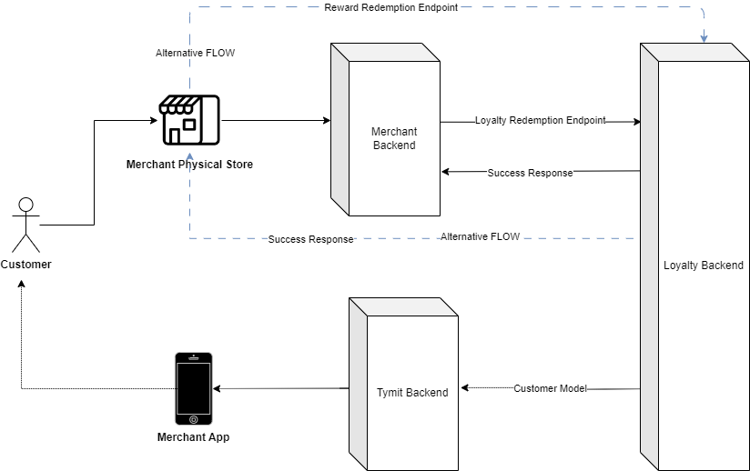

## Business Flows

### Tracking Purchases

Merchants send transaction data (e-commerce & POS) to the Loyalty backend for points calculation.  This updates the customer's Frasers Plus app balance.


### Reward Redemption

#### E-commerce

1.  Customer enters Reward ID & PIN.
2.  Merchant Backend requests authorization from Loyalty API.
3.  Payment authorized; funds reserved.
4.  Merchant Backend initiates capture/void/refund calls (see [API Integration](#api-integration)).


#### Physical Stores (POS)

1.  Customer scans Reward ID.
2.  Merchant Backend/POS requests authorization & capture from Loyalty API.
3.  Payment authorized & captured.
4.  Merchant Backend/POS initiates refund calls (see [API Integration](#api-integration)).



## API Integration

### Transaction API

*   **Purpose:**  Send transaction data (Order Complete, Refund, etc.) for points calculation.
*   **Contact:** FGFS for field mapping & data sending method (batch preferred).

#### Example: Order Complete Tracking Plan

| Property Name           | Description                                  | Status   | Type   |
| :---------------------- | :------------------------------------------- | :------- | :----- |
| affiliation             | Affiliate partner (e.g., 'rakuten')          | Optional | string |
| billing\_address\_1    | Billing Address Line 1                       | Optional | string |
| billing\_country       | Billing Address Country                      | Optional | string |
| billing\_postcode      | Billing Address Postcode                     | Optional | string |
| currency                | Customer's Currency (e.g., 'GBP')            | Required | string |
| discount                | Total Order Discount (local currency)        | Required | number |
| discount\_gbp           | Total Order Discount (GBP)                   | Required | number |
| email                   | User's Verified Email                        | Required | string |
| fascia                  | Fascia Short Code (from FGFS)               | Required | string |
| loyalty\_id             | Frasers Plus Account ID                      | Required | string |
| order\_id                | Customer-Facing Order ID                     | Required | string |
| payment\_methods        | Payment Methods Used                         | Required | array  |
| products                | Array of Products in Cart                     | Required | array  |
| products[].name        | Product Name                                 | Required | string |
| products[].price       | Product Unit Price (local currency, incl tax) | Required | number |
| products[].quantity    | Product Quantity                             | Required | number |
| products[].sku         | Product SKU (11 digits)                      | Required | string |
| subtotal                | Products Subtotal (local currency, excl tax) | Required | number |
| tax                     | Total Order Tax (local currency)             | Required | number |
| total                   | Total Order Value (local currency, incl tax) | Required | number |

### Reward Redemption API

#### E-commerce

API Documentation: [TBC](https://app.swaggerhub.com/apis/tymit/Tymit-cobrands-eCommerce-api/1.1.0#/Registration/post_cobrands_checkout_registration)

##### POST /redeem (AUTHORIZATION)

*   **Purpose:** Authorize Reward payment.
*   **URL:** `POST <https://brand.external.frasers.plus/redeem/v1/authorize>`

```json
{
  "loyaltyId": "A1B2C3D4E5",
  "pin": "1111",
  "fascia": "FLAN",
  "storeId": "1234",
  "orderId": "FLAN40000012345678",
  "currency": "GBP",
  "redemptionAmount": 1.23
}
 
POST /redeem (CAPTURE) 
Purpose: Capture authorized Reward payment (goods ready to ship).
URL: POST <https://brand.external.frasers.plus/redeem/v1/capture> 
{
  "token": "3ZDKCbGXK3FGtscnX",
  "amount": 1.23
}
 
POST /redeem (VOID) 
Purpose: Cancel authorized Reward payment (e.g., product unavailable).
URL: POST <https://brand.external.frasers.plus/redeem/v1/void> 
{
  "token": "3ZDKCbGXK3FGtscnX"
}
 
POST /redeem (REFUND) 
Purpose: Refund Reward payment (customer returned goods).
URL: POST <https://brand.external.frasers.plus/redeem/v1/refund> 
{
  "token": "3ZDKCbGXK3FGtscnX",
  "amount": 1.23
}
 
Physical Stores (POS) 
POST /redeem (AUTHORIZATION_CAPTURE) 
Purpose: Authorize & Capture Reward payment simultaneously.
URL: POST <https://brand.external.frasers.plus/redeem/v1/authCapture> 
{
  "loyaltyId": "A1B2C3D4E5",
  "pin": "1111",
  "fascia": "FLAN",
  "storeId": "1234",
  "orderId": "FLAN40000012345678",
  "currency": "GBP",
  "redemptionAmount": 1.23
}