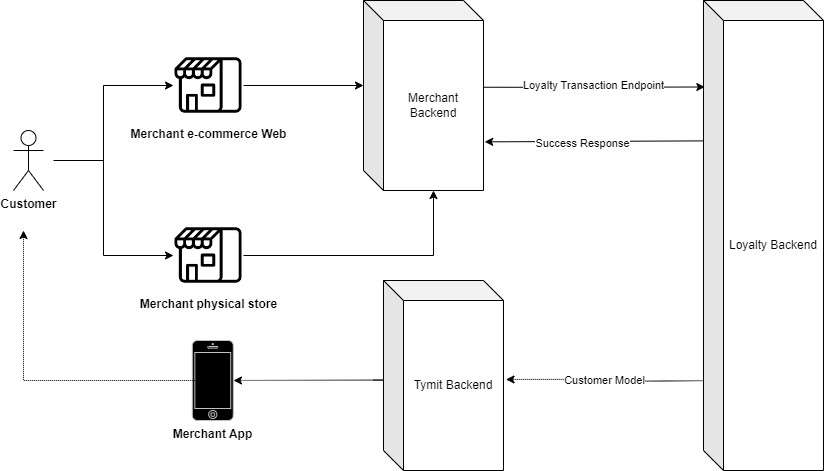
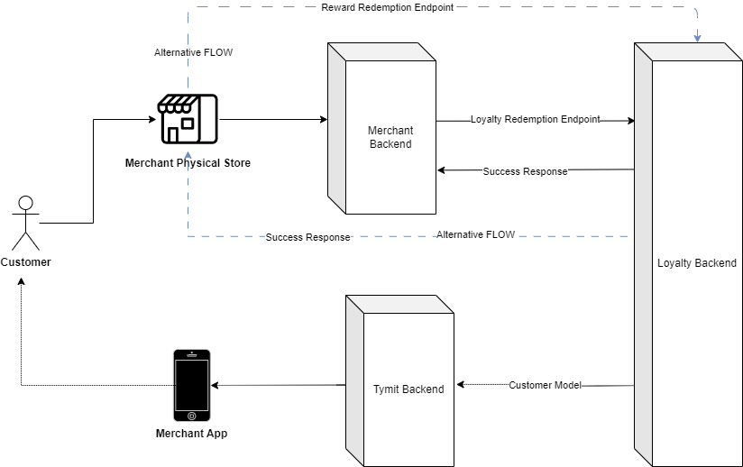

## Business Flows

To integrate your merchant operations with Frasers Plus Loyalty, it's important to understand how Merchants interact with Frasers Plus Loyalty and the overall high-level flow. We will explain two main business flows: tracking purchases from e-commerce and from physical stores (POS) and redemption of rewards from e-commerce and from physical stores.

### Tracking Purchases

To calculate Frasers Plus Loyalty points the merchant must provide Frasers Plus transaction data from the Ecommerce and Retail environments to the Loyalty backend. Loyalty backend will associate the transaction to the customer and calculate points which will be passed back to the Frasers Plus backend to update the Frasers Plus app with the current pending points balance.



### Reward Redemption

#### E-commerce Reward Redemption

Where the customer chooses to pay with a Frasers Plus Reward the customer enters their Reward identifier and PIN code, the Merchant Backend requests to Loyalty Reward redemption authorisation endpoint. The merchant backend will receive a http response code and payload including relevant information. At this stage the payment has been authorised and the funds ringfenced. Subsequent endpoints would be called from the merchant backend for capture, void or refund flows, further detail in the [API Integration section](#_API_Integration).

GET

#### Physical Stores (POS) Redemption

Where the customer chooses to pay with a Frasers Plus Reward the customer scans their Reward identifier, the Merchant Backend or direct from POS (alternate flow) requests to Loyalty Reward redemption authorisation/capture endpoint. The merchant backend/POS will receive a http response code and payload including relevant information. At this stage the payment has been authorised and captured. Subsequent endpoints would be called from the merchant backend/POS for refund flow, further detail in the [API Integration section](#_API_Integration).



### API Integration

Merchants will have access to the following API’s to integrate with Frasers Plus loyalty for sending transaction data and making a payment using Frasers Plus Rewards

#### Transaction API

This endpoint serves as the entry point to Frasers Plus Loyalty for e-commerce and physical stores transactions. All transactions made using Frasers Plus as a tender type will need to be sent to the Loyalty backend to process points calculation. This includes all transaction events:

\* Order Complete

\* Order Refund

\* Cancellation/void

\* Exchange

\* Shipped (TBC)

Frasers Group Financial Services will work with you to map the relevant fields and confirm mandatory values and determine the best library and method to send transaction data to the endpoint, batch being the preferred.

Example of an order complete tracking plan:

| **Property Name**                   | **Description**                                                                                                           | **Property Status** | **Property Data Type** |
| ----------------------------------- | ------------------------------------------------------------------------------------------------------------------------- | ------------------- | ---------------------- |
| affiliation                         | Affiliate partner identifier e.g. 'rakuten'                                                                               | Optional            | string                 |
| billing_address_1                   | Billing or Delivery Address Line 1                                                                                        | Optional            | string                 |
| billing_address_2                   | Billing or Delivery Address Line 2                                                                                        | Optional            | string                 |
| billing_address_3                   | Billing or Delier Address line 3                                                                                          | Optional            | string                 |
| billing_country                     | Billing or Delivery Address Country                                                                                       | Optional            | string                 |
| billing_postcode                    | Billing or Delivery Addreses Postcode                                                                                     | Optional            | string                 |
| coupon                              | Promotion code name. For multiple coupons just comma separate in a single string (not an array)                           | Optional            | string                 |
| currency                            | Customer's local currency. E.g. 'GBP', 'USD', 'EUR'.                                                                      | Required            | string                 |
| discount                            | Total discounts applied to the order in customer's local currency                                                         | Required            | number                 |
| discount_gbp                        | Total discounts applied to the order in GBP                                                                               | Required            | number                 |
| email                               | User's verfieid email address.                                                                                            | Required            | string                 |
| fascia                              | Short code associated to Fascia as provided by FGFS                                                                       | Required            | string                 |
| fascia_id                           | The Fascia ID = \<short*code\> + "*"+ \<web_user_id\>                                                                     | Optional            | string                 |
| internal_order_id                   | Unique internal (non customer facing) ID for an order.                                                                    | Optional            | string                 |
| loyalty_id                          | The customer's Frasers Plus Account ID (10 character alphanumeric)                                                        | Required            | string                 |
| order_id                            | Customer Facing unique ID for an order                                                                                    | Required            | string                 |
| order_status                        | Indicates if the customer took possession of the products in the order at the time of the Order Completed event           | Required            | string                 |
| payment_methods                     | Which payment methods were used.                                                                                          | Required            | array                  |
| product_discount                    | Discount value applied to products, in the customer's local currency                                                      | Required            | number                 |
| product_discount_gbp                | Discount value applied to products, in GBP                                                                                | Required            | number                 |
| products                            | Array of products in the cart                                                                                             | Required            | array                  |
| products.\$                         | Product item                                                                                                              | Required            | object                 |
| products.items.brand                | Product brand                                                                                                             | Optional            | string                 |
| products.items.category             | Product category                                                                                                          | Optional            | string                 |
| products.items.category_id          | Product's category id                                                                                                     | Optional            | string                 |
| products.items.color                | Clean colour                                                                                                              | Optional            | string                 |
| products.items.image_url            | URL to an image of the product                                                                                            | Optional            | string                 |
| products.items.is_full_price        | true if the product is for sale at full price, false otherwise                                                            | Required            | boolean                |
| products.items.member_price_scheme  | Applicable price book                                                                                                     | Optional            | string                 |
| products.items.name                 | Product's name                                                                                                            | Required            | string                 |
| products.items.price                | Product's unit price (in local currency). Includes tax, excludes discount.                                                | Required            | number                 |
| products.items.price_excl           | Product's unit price (in local currency). Excludes tax, excludes discount.                                                | Required            | number                 |
| products.items.price_excl_gbp       | Product's unit price (in GBP). Excludes tax, excludes discount.                                                           | Required            | number                 |
| products.items.price_gbp            | Product's unit price (in GBP). Includes tax, excludes discount.                                                           | Required            | number                 |
| products.items.product_discount     | Discount value applied to this item, in the customer's local currency                                                     | Required            | number                 |
| products.items.product_discount_gbp | Discount value applied to item, in GBP                                                                                    | Required            | number                 |
| products.items.product_id           | Product's id (Style code)                                                                                                 | Optional            | string                 |
| products.items.quantity             | Quantity of the product added                                                                                             | Required            | number                 |
| products.items.sku                  | Product sku (the full 11 digits)                                                                                          | Required            | string                 |
| products.items.sub_category         | Product's sub category                                                                                                    | Optional            | string                 |
| products.items.subtotal             | Quantity of item X price of item in customer's local currency. Does not include tax, discounts                            | Required            | number                 |
| products.items.subtotal_gbp         | Quantity of item X price of item in GBP. Does not include tax, discounts                                                  | Required            | number                 |
| products.items.tax                  | Total tax applied to the order (in customer's local currency). Does not include duty.                                     | Required            | number                 |
| products.items.tax_gbp              | Total tax applied to the item in GBP. Does not include duty.                                                              | Required            | number                 |
| products.items.total                | Total value paid by the customer for this item in the customer's local currency. Inc. Tax, Discounts.                     | Required            | number                 |
| products.items.total_gbp            | Total value paid by the customer in GBP. Inc. Tax, Discounts.                                                             | Required            | number                 |
| products.items.variant              | Clean size description                                                                                                    | Optional            | string                 |
| promise_date                        | ISO 8601 string for the 'promise date' or 'expected delivery date'.                                                       | Optional            | string                 |
| shipping                            | Shipping price excl tax                                                                                                   | Required            | number                 |
| shipping_destination_code           | Location that the item can be collected from.                                                                             | Optional            | string                 |
| shipping_discount                   | Discount value applied to shipping, in the customer's local currency                                                      | Required            | number                 |
| shipping_discount_gbp               | Discount value applied to shipping, in GBP                                                                                | Required            | number                 |
| shipping_gbp                        | Shipping price in local currency excl tax                                                                                 | Required            | number                 |
| shipping_method                     | E.g. Next Day Delivery, Standard, Click and Collect, etc. For physical in-store purchases use 'In Person'                 | Required            | string                 |
| shipping_tax                        | Total tax applied to shipping in local currency. Does not include duty.                                                   | Required            | number                 |
| shipping_tax_gbp                    | Total tax applied to shipping in GBP. Does not include duty.                                                              | Required            | number                 |
| shop_code                           | Unique number to identify the retail or web branch                                                                        | Optional            | string                 |
| subtotal                            | Quantity of products X price of products in customer's local currency. Does not include tax, discounts, delivery charges. | Required            | number                 |
| subtotal_gbp                        | Quantity of products X price of products in GBP. Does not include tax, discounts, delivery charges.                       | Required            | number                 |
| tax                                 | Total tax applied to the order (in customer's local currency). Does not include duty.                                     | Required            | number                 |
| tax_gbp                             | Total tax applied to the order in GBP. Does not include duty.                                                             | Required            | number                 |
| total                               | Total value paid by the customer in the customer's local currency. Inc. Delivery, Tax, Discounts.                         | Required            | number                 |
| total_gbp                           | Total value paid by the customer in GBP. Inc. Delivery, Tax, Discounts.                                                   | Required            | number                 |
|                                     |                                                                                                                           |                     |                        |
|                                     |                                                                                                                           |                     |                        |

Example of an Order Refund Tracking Plan

### Reward Redemption API

#### E-commerce Reward Redemption

API documentation → [TBC](https://app.swaggerhub.com/apis/tymit/Tymit-cobrands-eCommerce-api/1.1.0#/Registration/post_cobrands_checkout_registration)

**POST/redeem (AUTHORIZATION):** The Redeem Authorisation endpoint in the Frasers Plus Loyalty API is the initial step for merchants to request payment for a purchase using a Frasers Plus Reward.

**Request Method: POST**

**Endpoint URL:** POST <https://brand.external.frasers.plus/redeem/v1/authorize>

```json
{
  "loyaltyId": "A1B2C3D4E5",
  "pin": "1111",
  "fascia": "FLAN",
  "storeId": "1234",
  "orderId": "FLAN40000012345678",
  "currency": "GBP",
  "redemptionAmount": 1.23
}
```

#### POST/redeem (CAPTURE): The Capture endpoint in the Frasers Plus Loyalty API is the second step in the Reward payment process. This step is initiated when the Merchant warehouse confirms that the goods are ready to be sent to the customer. The Merchant requests payment capture by sending a POST request to the loyalty endpoint.

**Request Method: POST**

**Endpoint URL:** POST <https://brand.external.frasers.plus/redeem/v1/capture>

```json
{
  "token": "3ZDKCbGXK3FGtscnX",
  "amount": 1.23
}
```

**POST/redeem (VOID):** It is the next step after an _ACCEPTED_ authorisation when the e-commerce needs to cancel the purchase, for instance if the product is no longer available in the warehouse. Once the Merchant Backend confirms that the goods cannot be sent to the customer, it requests to Loyalty endpoint again. As a result of this, the reward balance will be cancelled and show as an available Reward on the customer account.

**Request Method: POST**

**Endpoint URL:** POST <https://brand.external.frasers.plus/redeem/v1/void>

```json
{
  "token": "3ZDKCbGXK3FGtscnX"
}
```

#### **POST/redeem (REFUND):** It is the next step after CAPTURE when the customer returns some goods therefore customer reward needs to be amended. Once the Merchant Backend confirms that the goods have been returned, it requests to Loyalty endpoint again. As a result of this, the purchase will be shown as _returned_ in customer bill, and the available reward will be visible on the customer account.

**Request Method: POST**

**Endpoint URL:** POST <https://brand.external.frasers.plus/redeem/v1/refund>

```json
{
  "token": "3ZDKCbGXK3FGtscnX",
  "amount": 1.23
}
```

#### Physical Stores (POS) Reward Redemption

**POST /redeem (AUTHORIZATION_CAPTURE):** both authorisation and capture processes are combined and initiated simultaneously since the customer makes a purchase in a physical store and receives the products immediately after payment.

**Request Method: POST**

**Endpoint URL:** POST <https://brand.external.frasers.plus/redeem/v1/authCapture>

```json
{
  "loyaltyId": "A1B2C3D4E5",
  "pin": "1111",
  "fascia": "FLAN",
  "storeId": "1234",
  "orderId": "FLAN40000012345678",
  "currency": "GBP",
  "redemptionAmount": 1.23
}
```
