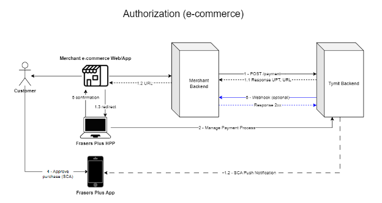

The following sections describe and demonstrate the user flows and integration mechanisms with the **Frasers Plus** payment system.

## Business Flows

In order to integrate your merchant with **Frasers Plus** payment system, the following section will provide an understanding of how _Merchants_ interact.

There are two main flows: purchase from e-commerce and purchase from In-store (POS).

### E-commerce Payment


The customer is purchasing from the Merchant e-commerce. At some point they want to pay the basket. They select the option to pay with the **Frasers Plus** option. There are 3 main scenarios:

1.  The customer already has an account in **Frasers Plus**. In this case the customer will receive a push notification in the app to approve the payment (this flow in e-commerce is known as **Fast Track**).  
    In the meantime customer browser will be redirected to the **Frasers Plus HPP** until process is finished.

2.  The customer may have an account in **Frasers Plus,** but customer data provided (e.g. name, surname) differs from **Frasers Plus** payment system info, this is called **Partial Match**. Customer browser will be redirected to the **Frasers Plus HPP.** It will trigger customer verification process through SMS OTP, once challenge is passed, the customer will receive a push notification in the app to approve the payment.

3.  The customer does not have an account in **Frasers Plus**, this is called **New Customer**. Customer browser will be redirected to the **Frasers Plus HPP.** It will trigger onBoarding process into **Frasers Plus**. When finished the customer will receive a push notification in the app to approve the payment.

### In-store Payment (POS)


The customer is purchasing In-Store. At some point they want to pay at the counter. Then there are 2 scenarios:

1.  The customer already has an account in **Frasers Plus**. In this case the customer will login to the app and will show the payment QR code to pay in the POS.

2.  The customer does not have an account in **Frasers Plus**. In this case the store will probably have a QR code to scan, which contain a link with the landing page in the **Frasers Plus Landing Page** to start the on-boarding process. Customer will be prompted to download the **Frasers Plus** App at some point to finish the onboarding. After that, the customer will be able to use the payment QR code.

## API Integrations

Once we understand the above section on how Merchants interact with **Frasers Plus** through the main flows, let’s explain the API integration.

Merchants will have the next APIs to integrate with **Frasers Plus** to make payments:

- **E-comm Payment API** → there is just 1 endpoint, to start the process POSTing a Payment AUTHORIZATION and finishing it with the following options: CATURE, REVERSAL and CREDIT

- **POS Payment API** → there is just 1 endpoint, to execute the process POSTing a Payment AUTHORIZATION_CATURE action. In this flow there is no further actions.

Next we will explain all the details of the above integrations.

### E-commerce Payment API

Full, detailed technical documentation is available in Swagger at the following location. However a summary of the endpoint is included in this section.

[Swagger API documentation](https://app.swaggerhub.com/apis/tymit/tymit-merchants-ecommerce-api/1.0.0)

#### POST /payment (AUTHORIZATION)

POST Payment is the first endpoint that the merchant (only e-commerce) request to pay the purchase. The aim is to obtain the **Unique Payment Token (UPT)** to later GET Payment details, and the _url_ to redirect the browser to the **Frasers Plus HPP.**

From user experience, this happens when the customer clicks on pay the basket with **Frasers Plus** option.

**Endpoint:** POST to https://{environment-url}/v1/payment (more details in the API documentation).

```json
{
  "paymentId": "09900022030372702871537096",
  "type": "AUTHORIZATION",
  "method": "ONLINE",
  "mcc": "2017",
  "customer": {
    "id": "eff1ee72-88e6-11ec-a8a3-0242ac120002",
    "firstName": "Joe",
    "lastName": "Doe",
    "phone": "+441234567890",
    "email": "joe.doe@email.com",
    "billingAddress": {
      "city": "San Francisco",
      "country": "US",
      "line1": "123 Main Street",
      "line2": "",
      "postalCode": "94111",
      "state": "CA",
      "region": ""
    },
    "deliveryAddress": {
      "city": "San Francisco",
      "country": "US",
      "line1": "123 Main Street",
      "line2": "",
      "postalCode": "94111",
      "state": "CA",
      "region": ""
    }
  },
  "merchant": {
    "id": "f41201ea-88e6-11ec-a8a3-0242ac120002",
    "name": "Merchant Name",
    "redirectUrl": "https://example.com",
    "metadata": {
      "optionalField1": "optionalValue1"
    }
  },
  "avs": false,
  "description": "Cycle Mitts, Tyre Repair Kit, Bike",
  "paymentAmount": {
    "amount": 500.89,
    "currency": "GBP"
  },
  "expiresAt": "2022-02-22T22:10:47.720Z",
  "basketTimestamp": "2022-02-22T22:00:47.720Z",
  "metadata": {
    "optionalField1": "optionalValue1"
  }
}
```

- merchant.id will be provided by Tymit as part of the merchant registration process (see Merchant Registration section below)

- paymentId, customer.id, merchant.redirectUrl will be provided by the merchant with merchant internal values/identifiers.

  - redirectUrl will be the url where will be redirected the customer once the payment is completed/declined/failed from the Hosted Payment Page. Every merchant can include any identifier parameters (path and query). We will amend a query param paymentResult with the outcome of the operation. Nonetheless, we strongly recommend to perform a GET to our API in order to get the result after the redirection.

- metadata, merchant.metadata will be optionally provided by the merchant with any value(s)

Regarding the response, it will contain _UPT_ and a _URL_:

```json
{
  "uniquePaymentReference": "f41201ea-00e6-11ec-a8a3-987654321098",
  "redirectUrl": "https://application.pay.frasers.plus/checkout/redirect?sessionId=f41201ea-00e6-11ec-a8a3-987654321098"
}
```

Merchants backend system should do the following:

- Store UPT linked to the paymentId for further Payment details verification process.

- Send the URL to the _Merchant e-commerce Web_ so customer browser can be redirected to that URL. That is in fact the **Frasers Plus HPP.**

#### **Authorization** **webhook**

If configured (\*), Frasers Plus backend system will call a webhook API endpoint exposed by the Merchant Backend, with the result of the Payment Authorization.

Endpoint: POST to https://{merchant-domain}/{merchant_authorization_endpoint}

```json
{
  "uniquePaymentReference": "f41201ea-00e6-11ec-a8a3-987654321098",
  "type": "AUTHORIZATION",
  "status": "APPROVED",
  "paymentAmount": {
    "amount": 100.0,
    "currency": "GBP"
  },
  "actionDate": "2022-02-22T22:10:47.720Z",
  "metadata": {
    "merchantReference": "12344-45566"
  }
}
```

status field value will be: “APPROVED” or “DECLINED”.

**Managing responses:**

- 2XX. Webhook call will be considered successful. No retry.

- 4XX. Webhook call will be discarded. No retry.

- 429, 5XX and other. Webhook call will be retried 3 times with an exponential backoff mechanism. Once exhausted, it will go to DLQ for future re-process if required.

**Webhook considerations**

This notification process is design with “At least once” approach, meaning the Merchant Backend may receive more than once the same request with the same uniquePaymentReference. Merchant Backend must be ready to handle that scenario responding with a 2XX eventually.

Given the asynchronous nature of this communication, Merchants must not expect webhook and web page redirection happening in any specific order.

_\* If webhooks are not enabled, it is strongly advised to “poll” the GET endpoint during the authorisation process to identify when a customer has responded to the authorisation approval request in the Frasers Plus app. This mitigates the risk that the customer chooses not to return to the hosted payment page (and subsequently the merchant site) following the in app approval resulting in the funds being authorised, but no order being placed._



#### **PUT /payment (CAPTURE)**

REVERSAL and CAPTURE are exclusive, only one can happen after AUTHORIZATION.

It is the second step in e-commerce payment after the payment is APPROVED. Once the Merchant warehouse can confirm that the goods can be sent to the customer, it requests to Payment e-commerce endpoint again, but this time with type _CAPTURE_ in the payload. The response will contain the status of the CAPTURE process. As a result of this, the payment will be shown as _COMPLETED._

**Endpoint:** PUT to https://{environment-url}/v1/payment/{uniquePaymentReference} (more details in the API documentation).

```json
{
  "type": "CAPTURE",
  "paymentAmount": {
    "amount": 500.89,
    "currency": "GBP"
  }
}
```


The following flows allows to return the credit to the customer if the initial purchase is somehow cancelled.

#### **PUT /payment (REVERSAL)**

_Reversal_ flow will be used when e-commerce cancels a customer authorization before Capture.

REVERSAL and CAPTURE are exclusive, only one can happen after AUTHORIZATION.

It is the next step after an _APPROVED_ authorization when the e-commerce needs to cancel the purchase, for instance if the product is no longer available in the warehouse. Once the Merchant Backend confirms that the goods can NOT be sent to the customer, it requests to Payment e-commerce endpoint again, but this time with type _REVERSAL_ in the payload. As a result of this, the purchase will be shown as _CANCELLED_ in customer bill, and the available credit will be increased accordingly.

**Endpoint:** PUT to https://{environment-url}/v1/payment/{uniquePaymentReference} (more details in the API documentation).

```json
{
  "type": "REVERSAL",
  "paymentAmount": {
    "amount": 500.89,
    "currency": "GBP"
  }
}
```

#### **PUT /payment (CREDIT)**

_Credit_ flow will be used when customer returns partially or totally the goods acquired.

CREDIT could happen only after transaction CAPTURE is properly processed.

It is the next step after _CAPTURE_ when the customer returns some goods therefore customer credit needs to be amended . Once the Merchant Backend confirms that the goods has been returned, it requests to Payment e-commerce endpoint again, but this time with type _CREDIT_ in the payload. As a result of this, the purchase will be shown as _returned_ in customer bill, and the available credit will be increased accordingly. CREDIT may happen several times for the same transaction, but total amount of credits should not be higher than original transaction amount.

**Endpoint:** PUT to https://{environment-url}/v1/payment/{uniquePaymentReference} (more details in the API documentation).

```json
{
  "type": "CREDIT",
  "paymentAmount": {
    "amount": 500.89,
    "currency": "GBP"
  }
}
```

#### GET /payment/

_Get_ **flow could be used to get full details of a payment at any point. Main use cases:**

- **Right after getting authorization webhook requests, to get full details before you trigger your PUT /payment (CAPTURE) process**

- **During polling process after POST /payment, if webhooks are not configured. To know when payment Authorization has been completed or declined, before you trigger your PUT /payment (CAPTURE) process**

- **To reconcile payment states on timeouts or 5xx scenarios during CAPTURE process, before you trigger your order fulfillment process.**

**Endpoint: GET to** https://{environment-url}/v1/payment/{uniquePaymentReference} **(more details in the API documentation). No request payload expected.**

**Example of response payload for a Payment with Authorization approved, not yet captured or reversed:**

```json
{
  "type": "AUTHORIZATION",
  "status": "APPROVED",
  "history": [
    {
      "type": "AUTHORIZATION",
      "paymentAmount": {
        "amount": 500.89,
        "currency": "GBP"
      },
      "actionDate": "2022-02-22T22:10:47.720Z",
      "metadata": {
        "paymentId": "09900022030372702871537096"
      }
    }
  ]
}
```

See section Mock API & “Magic Values” for more details.

### **POS Payment API**

API documentation → TBD

#### POST /payment (AUTHORIZATION_CAPTURE)

In POS flow the Payment process is done by a single request containing both transaction steps executed simultaneously to process the payment, _authorization_ and _capture._

**Endpoint:** POST to https://{environment-url}/v1/payment (more details in the API documentation).

(TBD) Example of payload:

TBD

In POS, both authorization and capture are sent at the same time, since the customer purchases in the physical store and once they pay, they take the products with them. The customer logs into the app, scan the payment QR code in the store to pay, at this moment the Merchant Backend requests to Payment POS endpoint with type _AUTHORIZATION_CAPTURE_ in the payload. Tymit response synchronously with an Accepted to the Merchant Backend and hence to the store in real time.


#### **PUT /payment (CREDIT)**

_Credit_ flow will be used when customer returns partially or totally the goods acquired.

CREDIT could happen only after transaction CAPTURE is properly processed.

It is the next step after CAPTURE when the customer returns some goods therefore customer credit needs to be amended . Once the Merchant Backend confirms that the goods has been returned, it requests to Payment e-commerce endpoint again, but this time with type _CREDIT_ in the payload. As a result of this, the purchase will be shown as _returned_ in customer bill, and the available credit will be increased accordingly. CREDIT may happen several times for the same transaction, but total amount of credits should not be higher than original transaction amount.

REVERSAL should not happen in POS API, because authorisation and capture happens simultaneously.

## Full Sequence diagrams

In this section we summarize the above API integration section in sequence diagrams.

### E-comm flows

#### Payment Auth: Fast track


#### Payment Auth: Partial match


#### Payment Auth: New customer


#### Payment Capture


#### Payment Reversal


#### Payment Credit


### POS Flow

#### QR Payment in Store


## Merchant Registration/Onboarding

In this handbook, we will explain from Business and technical perspective the process, the steps, and evaluations that are being done to wire up a new Merchant Fascia into the F+ Tymit ecosystem, this approach is being followed for ECommerce and POS; all being supervised by the relevant teams involved, and applying the already signed security, and architectural specs

The current Merchant Fascia onboarding is based on **2** main **pillars**:

1.  **Staging** **Integration** **verification**

    1.  Onboard Fascia in our **Staging** environment

    2.  Verify API Integration on: <https://app.swaggerhub.com/apis/tymit/tymit-merchants-ecommerce-api>

    3.  Develop, and test integration on with Merchant API (<https://merchant-api.staging.tymit.com>)

2.  **Production** **Integration**

    1.  Onboard Fascia in our **Production** environment

    2.  Develop, and test integration on with Merchant API ([https://merchant-api.frasersplus.fgfs.service](https://merchant-api.frasersplus.fgfs.service/))

### Onboard Merchant Fascia

#### Ecommerce

#### **To be provided by the Merchant to Tymit**

| **Requirement**                              | **Description**                                                                                                                                                                                                                                                                                     | **Examples**                                     |
| -------------------------------------------- | --------------------------------------------------------------------------------------------------------------------------------------------------------------------------------------------------------------------------------------------------------------------------------------------------- | ------------------------------------------------ |
| Merchant Sensitive Information contact email | The merchant will require to share an admin email of the group to which the relevant sensitive information will be shared back. The information needs to be provided in an email format to: [**platform@tymit.com**](mailto:platform@tymit.com) |                                                  |
| Merchant Platform Outgoing IPs               | Merchant IP in order to whitelist on Frasers Plus platform firewalls.                                                                                                                                                                                                                               | _35.178.42.70_, _3.121.132.125_, _3.121.132.126_ |
| Group Name                                   | The Merchant Group name that holds the onboarding of the new fascia. Usually a Merchant group can hold up the N fascias or on the other hand the Group Name can be the fascia it self.                                                                                                              | _Frasers Group_                                  |
| Fascia Name                                  | The Fascia name of the company to be onboarded; this is mainly the brand that will sell the products, usually a fascia belongs to a bigger group.                                                                                                                                                   | _Sports Direct_, _House of Fraser_, _Studio_     |

#### **To be returned to the Merchant by Tymit**

| **Requirement** | **Description**                                                                                                                                                             | **Examples**                                                       |
| --------------- | --------------------------------------------------------------------------------------------------------------------------------------------------------------------------- | ------------------------------------------------------------------ |
| API Key         | API key that will be used by the fascia of the merchant to communicate with Tymit v2 Payment platform                                                                       | q95WmxWu90Kelx3fNsLk1N4L, 0m93ue5pe9mp30u5rjv, k8gpoj7xrxn9q9hfpl4 |
| Store ID        | Identifier which will be needed to be used by the fascia of the merchant to communicate with Tymit v2 Payment Platform, and identify the identity with the provided API Key | MerchantstoreWz39t, MerchantdirectT2p9l, Merchandland93cv          |

#### Exchange of sensitive information

The sensitive information returned by Tymit will be done via [**Bitwarden Send**](https://bitwarden.com/products/send/) and the links will be exchanged to the outside world by via [**Microsoft Encrypted Emails**](https://support.microsoft.com/en-us/office/encrypt-email-messages-373339cb-bf1a-4509-b296-802a39d801dc) to the **email** **specified** by the information provided by the merchant.

#### Summary


## Security summary

| **API**   | **WAF Perimeter Security** | **API Inner security**   |
| --------- | -------------------------- | ------------------------ |
| ECommerce | IP Whitelisting            | **API** **Key** / Fascia |

### Webhook security

WAF Perimeter Security (on Merchants side)

IP addresses that webhooks will originate are as follow (as at 02/10/2024)…

- staging: 3.121.132.125 & 52.215.99.246

- production: 3.8.74.182 & 3.11.167.29

### Authentication Type

The merchant is required to provide a shared key to be included in the header of the webhook request. Value provided will be sent in the Authorization HTTP Header.

curl \<https://merchantdomain.com/webhook_uri_provided\> \\\\

\-H "Authorization:\$(auth_value_provided)"

## How to Test an Integration

### Development/Unit Testing

Development activity should be undertaken against the Mock (sandbox) APIs as shared in Swagger.

### Staging

To allow Merchants to test an integration with Frasers Plus, the following is required:

1.  The Staging host name will be issued to the Merchant to use in the Merchant's staging environment.

2.  Access to the Frasers Plus App in Test Flight that allows test Frasers Plus Pay accounts to be tested against.

3.  A Merchant ID to be issued for the merchant site to be tested.

4.  Private API Keys to be issued to the merchant for staging use.

5.  Exchange of IP addresses/ranges that need to be allowed on firewalls for staging.

6.  Agreement of the Merchant Name that the merchant is using in Staging to aid debug during testing.

## How to Promote to Production

To promote an integration to production, the following is required:

1.  The Production host name will be issued to the Merchant to use in the Merchant's production environment.

2.  A Merchant ID to be issued for the merchant site to be promoted to production.

3.  Private API Keys to be issued to the merchant for production use.

4.  Exchange of IP addresses/ranges that need to be allowed on firewalls for production.

5.  Confirmation of the Merchant Name that the merchant is using in production.
